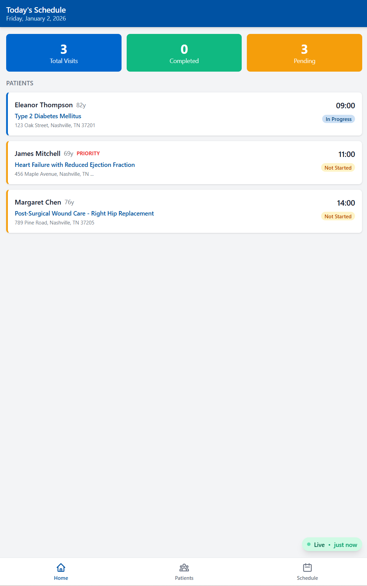
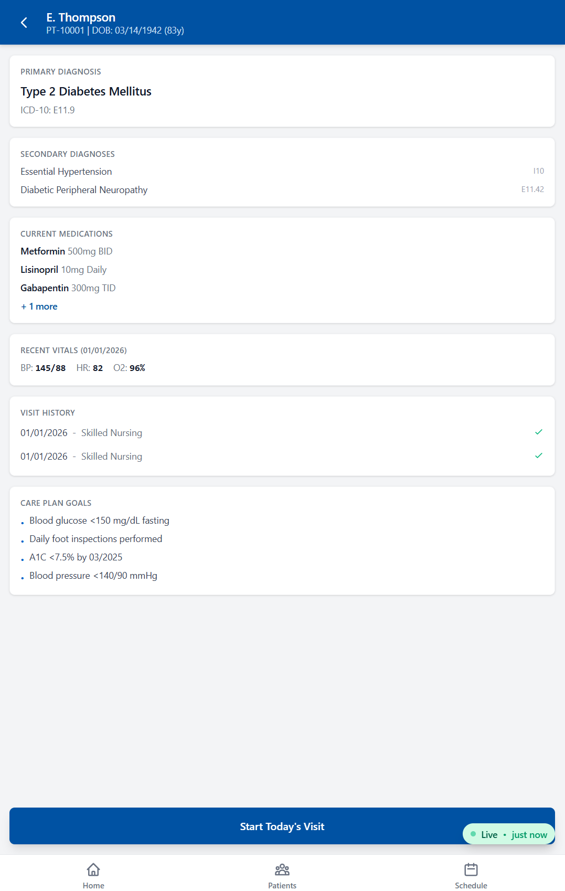

# Ratchet — Clinical Charting MCP Server

**Voice-to-structured-data for home health nursing.** Ratchet is an MCP server that enables Claude to document patient visits directly into Electronic Medical Records, eliminating hours of manual data entry for home health nurses.

> Built by [MeMyselfPlusAI](https://memyselfplusai.com) — an RN co-founder with AccentCare field experience + an engineer building at the intersection of AI and healthcare.

## The Problem

Home health nurses spend **35-45% of their workday** on documentation — filling out vitals, SOAP notes, care plans, and education checklists in clunky EMR systems. That's time taken away from patient care.

## How Ratchet Works

```
Nurse dictates visit notes in natural language
        │
        ▼
Claude Desktop + Ratchet MCP
  (voice → structured clinical data)
        │
        ▼
EMR System (via API) + Live Dashboard
```

Ratchet gives Claude three MCP tools that map natural language to structured clinical documentation:

| Tool | What It Does |
|------|-------------|
| `search_patient` | Find patients by name, ID, or phone number |
| `create_visit_note` | Document a full visit — vitals, SOAP notes, interventions, education |
| `get_patient_history` | Retrieve previous visits for clinical context |

A nurse says *"Jane Marple, BP 138/82, heart rate 76, O2 sat 97. Assessed bilateral feet — diminished sensation at 4 of 10 sites. Educated on daily foot inspection with mirror technique."* — and Ratchet structures it into validated clinical data with ICD-10-aware fields.

## Screenshots

| Dashboard | Patient Detail |
|-----------|---------------|
|  |  |

*Screenshots show the companion [EMR Dashboard](https://github.com/m2ai-mcp-servers/ratchet-demo-emr) displaying data populated by Ratchet via Claude.*

## Quick Start

### Claude Desktop

Add to your Claude Desktop config:

**macOS:** `~/Library/Application Support/Claude/claude_desktop_config.json`
**Windows:** `%APPDATA%\Claude\claude_desktop_config.json`

```json
{
  "mcpServers": {
    "ratchet": {
      "command": "npx",
      "args": ["-y", "mcp-ratchet-clinical-charting"]
    }
  }
}
```

Restart Claude Desktop. Try: *"Search for patient Jane Marple"*

### From Source

```bash
git clone https://github.com/m2ai-mcp-servers/mcp-ratchet-clinical-charting.git
cd mcp-ratchet-clinical-charting
npm install
npm run build
npm test     # 34 tests passing
```

## PHI-Safe Engineering

Ratchet is built for healthcare from day one — not retrofitted:

- **Log sanitization** — Patient IDs, names, diagnoses, medications, and notes are automatically redacted from all log output
- **Field-level redaction** — Sensitive fields are replaced with `[REDACTED]` before any data reaches stderr
- **Audit trail** — Operations logged with success/failure and duration, without exposing clinical data
- **Clinical validation** — Vital sign ranges validated (e.g., systolic BP 50-300, O2 sat 50-100%, pain 0-10)

See [SECURITY.md](SECURITY.md) for the full security policy and HIPAA compliance roadmap.

## Demo Mode

Ratchet runs in **mock mode** by default — no API keys needed. Mock mode uses synthetic patient data from Agatha Christie characters (clearly fictional):

| ID | Name | Status | Primary Diagnosis |
|----|------|--------|-------------------|
| PT-10001 | Jane Marple | Active | Type 2 Diabetes, CHF |
| PT-10002 | Hercule Poirot | Active | Heart Failure, AFib, CKD Stage 3 |
| PT-10003 | Ariadne Oliver | Active | Parkinson's Disease |
| PT-10004 | Arthur Hastings | Active | Post-stroke rehab |
| PT-10005 | Felicity Lemon | Discharged | Hip replacement recovery |

### Example Conversation

```
You: "Search for patient Jane Marple"
Claude: Found 1 patient — Jane Marple (PT-10001), Active, Type 2 Diabetes

You: "Create a visit note for PT-10001. BP 138/82, HR 76, O2 97%.
      Subjective: patient reports tingling in feet. Educated on foot care."
Claude: ✅ Visit note VN-30001 created — 45 min skilled nursing visit
        Vitals recorded, SOAP documented, education logged.

You: "Get visit history for PT-10001"
Claude: 2 previous visits found (most recent: 2024-12-20)
```

## Configuration

| Variable | Required | Description |
|----------|----------|-------------|
| `POINTCARE_API_URL` | No* | EMR API base URL |
| `POINTCARE_API_KEY` | No* | EMR API key |
| `SUPABASE_URL` | No | Supabase URL for dashboard sync |
| `SUPABASE_SERVICE_KEY` | No | Supabase key for dashboard sync |
| `RATCHET_MOCK_MODE` | No | Force mock mode (`true`/`false`) |
| `LOG_LEVEL` | No | `debug` / `info` / `warn` / `error` |

*Required for production EMR integration. Mock mode activates automatically when not set.

## Architecture

```
src/
├── index.ts              # MCP server entry (stdio transport)
├── config.ts             # Environment + mode configuration
├── tools/                # MCP tool definitions + handlers
│   ├── search-patient.ts
│   ├── create-visit-note.ts
│   └── get-patient-history.ts
├── services/             # Business logic + data layer
│   ├── patient-service.ts
│   ├── mock-data.ts
│   └── supabase-service.ts
├── types/                # TypeScript interfaces (Patient, Visit, VitalSigns)
└── utils/
    ├── logger.ts         # PHI-safe logger with field redaction
    └── errors.ts         # Typed error classes
```

## Development

```bash
npm run dev          # Watch mode (tsx)
npm test             # Jest (34 tests)
npm test -- --coverage
npm run build        # TypeScript → dist/
```

## Related Projects

- **[Ratchet EMR Dashboard](https://github.com/m2ai-mcp-servers/ratchet-demo-emr)** — React dashboard displaying visit data populated by this MCP server
- **[Live Demo](https://pointcare-emr-demo.netlify.app)** — Deployed dashboard with synthetic patient data

## License

MIT
